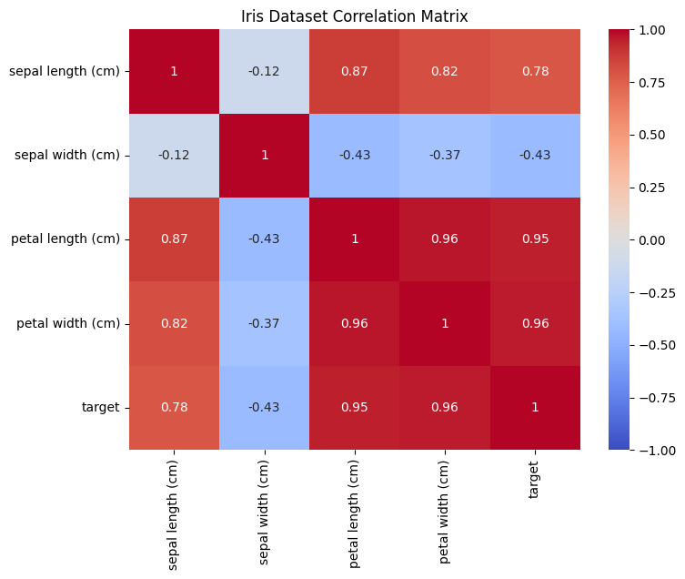

#+title: Sample First Post
#+author: Gowtham A R
#+date: <2026-02-22 Sun>
#+HUGO_BASE_DIR: ./../
#+HUGO_SECTION: posts
#+HUGO_WEIGHT: auto

* Introduction
This is my very first blog post using Hugo + Emacs. I am going to write a code block that pulls in iris dataset and plots the correlation plot between its features.

* Pulling data and plotting
#+begin_src jupyter-python :session iris :results file link :file ./../static/images/iris_feature_correlation.png :exports both
import seaborn as sns
import matplotlib.pyplot as plt
from sklearn.datasets import load_iris
import pandas as pd

# Load dataset
iris = load_iris(as_frame=True)
df = iris.frame

# Calculate correlation matrix
corr = df.corr()

# Plot heatmap
plt.figure(figsize=(8, 6))
sns.heatmap(corr, annot=True, cmap='coolwarm', vmin=-1, vmax=1)
plt.title("Iris Dataset Correlation Matrix")
plt.show()
#+end_src

#+RESULTS:

